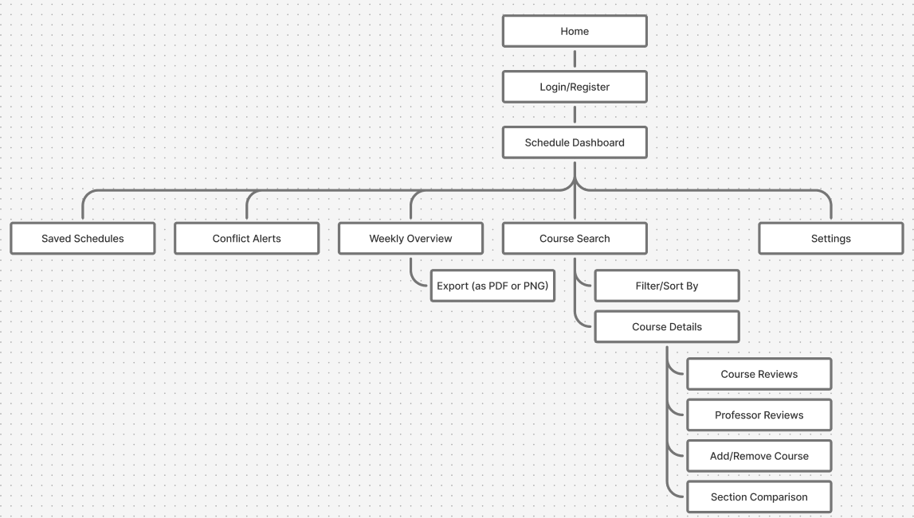
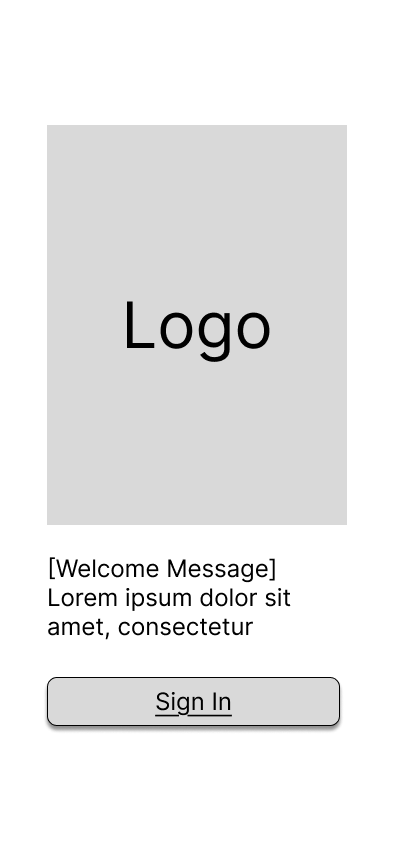
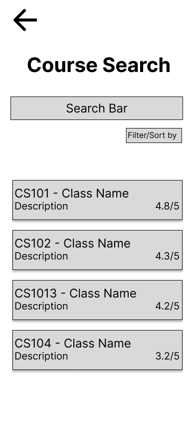
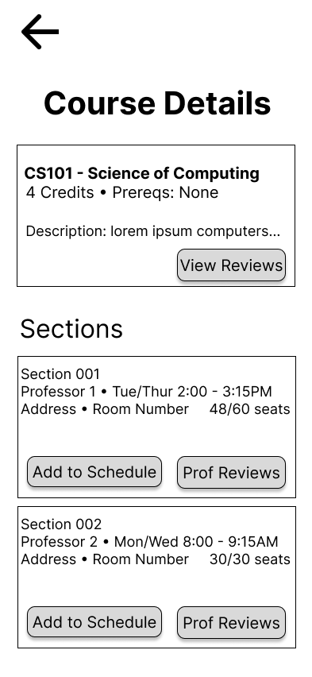
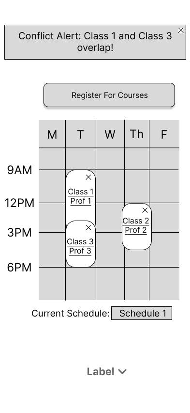
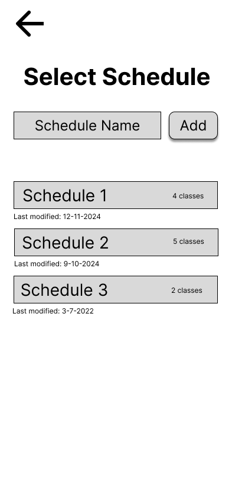
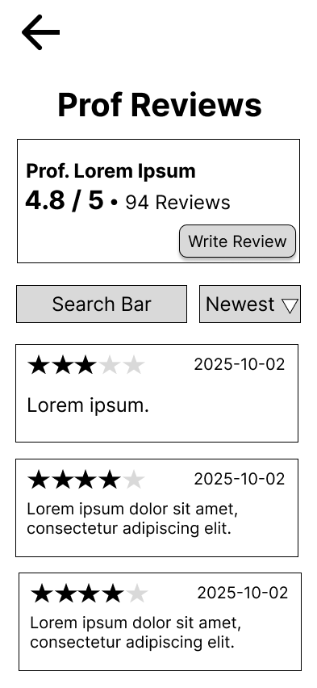
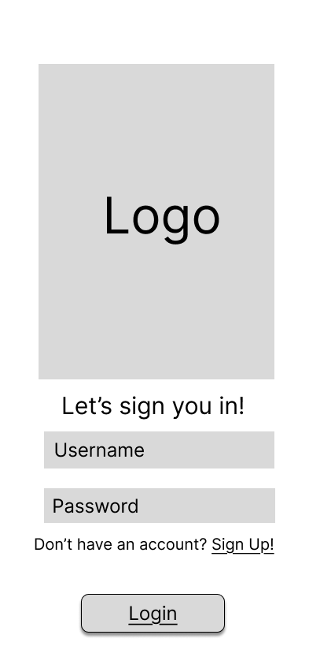
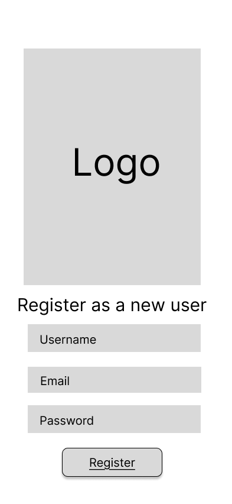
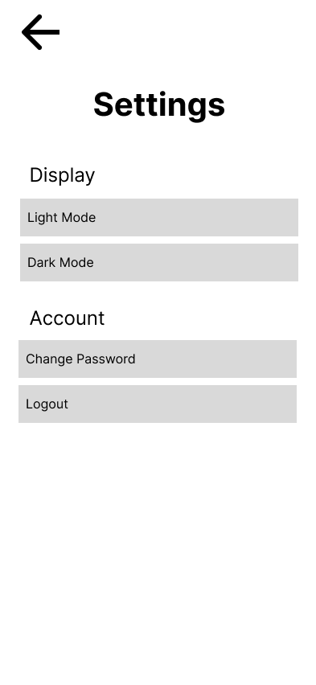

# User Experience Design

## Prototype

Figma link:
https://www.figma.com/proto/nVl1mry4LBLhwUrubcmduo/random_truthteller---Wireframe-Prototype?node-id=3-2&p=f&t=RALEUenKXlXPmvuP-1&scaling=scale-down&content-scaling=fixed&page-id=0%3A1&starting-point-node-id=3%3A2

## App Map Diagram:

## Wireframes

### Home

### Course Search

### Course Details

### Dashboard

### Saved Schedules

### Prof Reviews

### Login

### Register

### Settings

